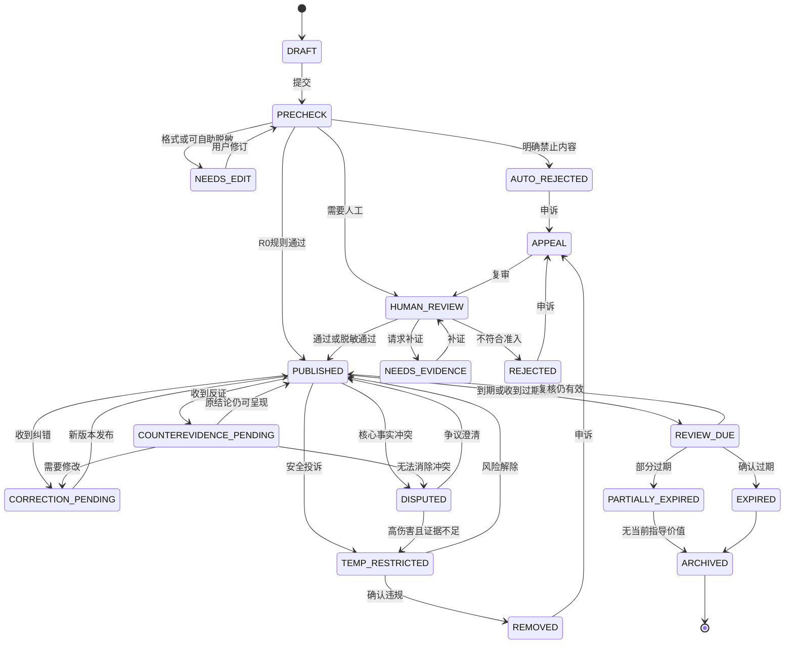

# 避坑指南：信任、安全、内容治理与隐私规范（V1）

> 文档角色：信任安全总监、内容治理负责人、隐私工程师共同维护
> 适用范围：用户投稿、评论、反证、投诉、纠错、审核后台、推荐与搜索
> 核心原则：减少可避免的损失，同时保护投稿人、被提及者、读者与平台本身
> 重要限制：**AI 只能辅助识别风险、提取信息和排序审核，不能凭空裁定事实、违法与否、责任归属或谁在说真话。**

## 1. 治理目标与底线

避坑指南不是“曝光墙”、情绪宣泄场或网络审判工具。平台把个体经历转化为可核查、可更新、可反驳的公共风险信息，帮助用户在行动前看见风险。

所有治理决策遵循以下优先级：

1. 人身安全与未成年人保护。
2. 防止隐私泄露、骚扰、诽谤和群体攻击。
3. 保留有证据、有条件边界、可操作的经验。
4. 保障被提及者的回应、反证、纠错和申诉权。
5. 显示信息的新鲜度、证据强度和不确定性。
6. 最小化收集、最小化展示、按期删除敏感数据。

平台明确禁止：

- 伪造“亲身经历”、证据、聊天记录、合同、票据或身份。
- 将猜测写成事实，将个案扩大为群体结论。
- 公开普通自然人的姓名、手机号、住址、证件、账号等可识别信息。
- 人肉搜索、威胁、勒索、骚扰、煽动围攻或现实报复。
- 侮辱性标签、歧视、羞辱外貌、疾病、性别、地域、种族或职业。
- 无证据指控具体主体实施诈骗、犯罪、性侵、贪污等严重违法行为。
- 公开未成年人身份、学校班级、行踪、监护冲突或性相关敏感信息。
- 以“避坑”为名发布广告、竞品攻击、敲诈式删帖或利益交换。

## 2. 内容对象与适用身份

- **投稿人**：提交亲历、见证或公开资料整理的用户。
- **被提及主体**：帖子中可识别的个人、商家、机构、产品、房源或服务。
- **读者**：浏览、收藏、评论、提交反证或投诉的用户。
- **审核员**：依据规则作程序性判断，不裁判现实纠纷。
- **专家审核员**：处理高风险法律、医疗、金融、未成年人和人身安全内容。
- **AI/规则系统**：执行格式检查、隐私检测、风险提示、重复检测和审核分流。

投稿必须标记信息来源类型：

- `FIRST_HAND`：投稿人亲身经历。
- `WITNESSED`：投稿人直接见证，但非事件当事人。
- `PUBLIC_SOURCE`：基于可访问的公开资料整理。
- `HEARSAY`：转述他人说法；V1 不允许作为独立指控发布，只能作为待核线索。
- `SIMULATED`：教学或演示样本；必须显著标注，不进入真实风险榜单。

## 3. 完整内容生命周期

### 3.1 投稿

投稿表单要求用户把“事实、感受、推断、建议”分开填写：

- 发生时间与地区，允许按月或城市级模糊化。
- 场景、问题类型、风险对象和适用人群。
- 实际发生了什么：只写可观察事实。
- 造成的损失或险情：金额使用区间，健康损害避免未经诊断的结论。
- 投稿人采取了什么措施、结果如何。
- 给读者的一句话行动建议。
- 证据类型、证据日期、是否同意仅供审核查看。
- 是否存在利益关系、纠纷、退款谈判或商业竞争关系。
- 内容建议复核日期。

用户提交前必须确认：

- 内容来自本人亲历、直接见证或已标注的公开来源。
- 已获得上传第三方私密材料所需的合法授权，或已完成必要脱敏。
- 理解“审核通过”不等于平台认证事实为真。
- 愿意接收补证、纠错、争议和过期通知。

### 3.2 自动预检

自动预检只生成风险信号，不作最终事实判断。V1 自动执行：

- 必填字段、长度、链接和文件类型校验。
- 手机号、邮箱、地址、证件号、车牌、银行卡、人脸、二维码等隐私检测。
- 辱骂、威胁、歧视、人肉、煽动围攻和自伤他伤信号检测。
- 严重违法指控、未成年人、医疗、金融和人身安全高风险分流。
- 重复投稿、异常高频投稿、批量账号和疑似广告检测。
- 图片 OCR 后再做敏感信息检测。
- 证据文件病毒扫描、格式解析和元数据清理。
- 时间、地区、主体、证据日期之间的一致性提示。

自动预检输出：

- 内容风险等级。
- 证据等级建议。
- 隐私遮挡建议。
- 是否需要人工或专家审核。
- 可解释的命中原因码。

### 3.3 审核

审核不是判案，而是判断内容是否达到平台的发布门槛：

- 低风险、无具体主体、无敏感信息、建议型内容可在规则通过后发布，并进入抽检。
- 涉及可识别主体、财产损失、专业建议或争议性评价的内容必须人工审核。
- 涉及严重违法指控、人身伤害、未成年人、医疗、金融投资、性相关内容的，必须专家复核；无法降低风险时拒绝公开。
- 证据不足但经验本身有价值时，可去主体化、改写为条件化经验，或标记“个案、尚未独立核实”。
- 审核员不得根据语气、身份、粉丝量或是否“像真的”判断真实性。

审核结果包括：

- 通过发布。
- 脱敏后通过。
- 降级为经验提醒。
- 请求补证或补充上下文。
- 限制传播，仅可通过精确搜索访问。
- 拒绝发布。
- 紧急冻结并移交安全响应。

### 3.4 发布

公开页面必须同时展示：

- 来源类型、证据等级、风险等级。
- 发生时间、最后核验时间和预计复核日期。
- “平台审核不代表事实认证”的提示。
- 适用条件和不适用条件。
- 已完成的隐私处理说明。
- “提交反证”“申请纠错”“认为已过期”“投诉”入口。

搜索和推荐不得只以互动量排序。高争议、低证据和陈旧内容必须降权，不得通过愤怒互动获得额外曝光。

### 3.5 反证

任何用户均可提交反证；涉及被提及主体时，可申请主体身份验证，但不得公开验证材料。

反证必须指向具体可核查主张，并标明：

- 反对哪一句或哪个事实字段。
- 反证类型和形成时间。
- 证据是否可公开，或仅供审核查看。
- 提交人与事件或主体的关系。

反证提交后：

1. 内容显示“存在待审反证”，但不自动下架。
2. 若反证提示可能造成现实伤害、隐私泄露或重大事实错误，先临时限流或冻结。
3. 审核员并列比较双方材料，只判断平台呈现是否需要更新。
4. 有效反证应追加到版本记录，必要时修改、降级、冻结或撤回原帖。
5. 原投稿人有回应机会，但不得接触反证提交人的非公开身份信息。

### 3.6 纠错

纠错分为：

- **轻微纠错**：错别字、格式、无实质影响的表述。
- **事实纠错**：日期、金额、地点、流程、主体等事实字段变化。
- **结论纠错**：原建议不再成立或风险方向发生变化。
- **安全纠错**：存在隐私、诽谤、人身风险，需立即处理。

事实或结论纠错必须保留版本历史，公开显示“修改了什么、为什么修改、何时修改”；不得悄悄改写争议事实。隐私删除不保留公开原文。

### 3.7 争议

当投稿人与反证方对核心事实存在冲突且平台无法独立确认时，进入争议状态：

- 页面显著标注“核心事实存在争议”。
- 暂停热门推荐和站外分发。
- 将确定事实、双方主张、可公开证据和未知事项分栏展示。
- 涉及严重名誉损害而证据不足时，隐藏具体主体或暂时下架。
- 平台不得用 AI “投票”、情绪分析或可信度分数裁定谁是真实的一方。

### 3.8 过期

“已过期”不是删除按钮，而是对信息时效的结构化挑战。读者可以选择：

- 规则或价格已经变化。
- 商家、服务、负责人或流程已经变化。
- 地区、季节、版本或政策不再适用。
- 风险已经修复。
- 原链接或证据已经失效。
- 内容太旧，无法指导当前决策。

达到复核日期、收到可信过期报告或关键外部条件变化时，内容进入 `REVIEW_DUE`：

- 页面显示“可能已过期，请谨慎参考”。
- 暂停进入高风险决策推荐位。
- 通知投稿人补充最新信息。
- 审核员核对新旧条件和公开依据。

处理结果可以是：

- 确认仍有效并刷新核验日期。
- 部分过期，只保留仍有效部分。
- 标记已解决，但保留历史经验。
- 过期归档，不再作为当前建议。

### 3.9 归档

归档内容不进入默认搜索、推荐和风险榜单，但在合法、必要且不伤害隐私的前提下保留：

- 版本变化和治理决策记录。
- 对公开知识仍有价值的历史背景。
- 申诉、审计和防止重复伤害所需的最小信息。

超过保留期限或已无合法必要性的原始证据必须删除；公开页面删除后，缓存和搜索索引应按 SLA 清除。

## 4. 风险等级

| 等级 | 定义 | 示例 | V1 处理 |
|---|---|---|---|
| `R0` 普通 | 无具体主体、低损失、一般经验 | 行李收纳、普通消费技巧 | 自动通过后抽检 |
| `R1` 关注 | 可识别商家/机构、轻微财产或服务争议 | 隐藏费用、退款困难 | 人工审核 |
| `R2` 较高 | 较大财产、就业、教育、住房、签证等重大决策 | 押金争议、合同陷阱、拒签风险 | 人工审核，证据门槛提高 |
| `R3` 高危 | 医疗、金融投资、人身安全、严重名誉影响 | 医疗伤害、诈骗或犯罪指控 | 专家复核，默认限流 |
| `R4` 紧急 | 现实威胁、自伤他伤、未成年人即时危险、人肉信息 | 暴力威胁、公开住址并号召围堵 | 立即冻结，安全响应 |

风险等级描述的是**错误发布可能造成的伤害**，不是平台对事件严重性的认定。

## 5. 证据等级

| 等级 | 定义 | 可用范围 |
|---|---|---|
| `E0` 无证据 | 只有主张或感受 | 不得指控可识别主体；可改为一般经验 |
| `E1` 弱佐证 | 单方叙述、无日期截图、无法确认来源 | 低风险内容；必须标记个案 |
| `E2` 基础佐证 | 订单、合同片段、带时间记录、公开页面存档之一 | 可支持有限事实陈述 |
| `E3` 多源佐证 | 两类独立材料，时间与主体一致 | 可提高搜索权重，但仍非事实认证 |
| `E4` 权威佐证 | 生效裁判、监管公告、官方书面结果或可核验公开数据 | 可陈述文件确认的范围，不可外推 |

规则：

- 证据等级衡量“材料支持公开表述的程度”，不等于事实真实性评分。
- 截图可以被伪造；AI 伪造检测只能作为风险信号。
- 证据只支持其明确覆盖的主张，不能由局部材料推导完整责任。
- 仅供审核的证据不得在公开页面泄露或被模型训练复用。

## 6. 隐私与脱敏

### 6.1 数据最小化

- 投稿表单不索取与判断内容无关的身份证明。
- 主体认证材料与内容证据分库存储，权限隔离。
- 原始证据默认私有；公开展示使用脱敏副本。
- 日志不得记录证件号、完整手机号、私信正文或访问令牌。
- 仅为审核、申诉、安全和法定义务保留必要数据。

### 6.2 必须遮挡的内容

- 身份证、护照、签证号、银行卡、订单号、学号、病历号。
- 手机、个人邮箱、家庭及精确住址、实时位置和行程。
- 普通自然人的真实姓名、头像、人脸、声音、社交账号和二维码。
- 未成年人的任何直接或组合可识别信息。
- 签名、印章、生物特征、设备标识和文件隐藏元数据。
- 聊天记录中无关第三方身份和私密内容。

对依法公开的企业名称、机构名称和公开职业联系方式，可在与风险事实直接相关且符合比例原则时展示。员工个人身份默认隐藏。

### 6.3 访问与保留

- 审核证据采用最小权限、访问审计和到期删除。
- R0–R1 原始证据建议保留 90 天；R2 建议 180 天；R3–R4 依申诉、安全和法律需要单独批准，默认不超过 365 天。
- 账号注销后删除非必要身份数据；因申诉、安全或法定义务暂存的，单独隔离并记录依据。
- 用户可申请访问、更正、删除和导出其个人数据。

## 7. 诽谤、人身攻击与主体保护

以下表述必须被拦截或改写：

- “某人就是骗子/罪犯”这类身份定性。
- “大家去举报/围堵/曝光他”的动员。
- 对动机、人格、精神状态作无依据推断。
- 从单次事件推导“永远、全部、专门坑某类人”。

允许的安全表达结构：

> 在【时间/地点/版本】下，我观察到【可核查事实】；我因此遭遇【具体影响】；现有材料为【证据类型】；该经历可能不代表其他时期或用户；行动前建议【可操作核验步骤】。

严重违法或职业失当指控只有在 E4 文件明确覆盖该结论时，才可引用文件原意；其余情况描述行为和可核事实，不给主体定罪。

## 8. 投诉、“否认”与已过期机制

### 8.1 投诉入口

投诉原因必须结构化，禁止只用“我不喜欢”触发删除：

- 泄露隐私。
- 内容虚假或关键事实错误。
- 诽谤、侮辱、歧视或骚扰。
- 冒充或伪造证据。
- 利益冲突、广告或竞品攻击。
- 未成年人风险。
- 自伤他伤或现实安全风险。
- 侵犯版权或其他合法权利。
- 信息已过期。

### 8.2 “否认”按钮

“否认”表示用户对一个具体主张提出异议，不代表多数票推翻事实：

- 必须选择被否认的句子或事实字段。
- 可填写理由并提交反证。
- 前台显示“有 X 项待审异议”，不显示站队式赞成/反对比例。
- 重复否认、组织化举报和恶意刷量只计为一个风险信号。
- 未经审核的否认不改变证据等级，也不自动删除帖子。

### 8.3 紧急处理

投诉涉及精确住址、证件、未成年人身份、现实威胁或明显冒充时，先隐藏相关内容，再审核；其他投诉遵循“通知—核查—处理—告知—申诉”程序。

## 9. 状态机

任何状态变化必须记录：操作者、时间、原因码、规则版本、公开说明、内部说明和关联证据；系统自动动作须记录模型或规则版本。

## 10. 原因码

### 10.1 准入与证据

| 原因码 | 含义 | 默认动作 |
|---|---|---|
| `ADM_MISSING_CONTEXT` | 缺少时间、地区、版本或适用条件 | 请求补充 |
| `ADM_NOT_FIRSTHAND` | 声称亲历但无法确认来源类型 | 改标来源或退回 |
| `EVD_INSUFFICIENT` | 证据不足以支持当前表述 | 降级表述或补证 |
| `EVD_INCONSISTENT` | 材料间时间、主体或事实冲突 | 人工复核 |
| `EVD_SUSPECTED_FORGERY` | 存在疑似篡改信号 | 冻结，人工核验 |
| `EVD_SCOPE_OVERREACH` | 结论超出证据覆盖范围 | 改写 |

### 10.2 隐私与安全

| 原因码 | 含义 | 默认动作 |
|---|---|---|
| `PRV_DIRECT_IDENTIFIER` | 包含直接身份信息 | 自动遮挡或退回 |
| `PRV_PRECISE_LOCATION` | 泄露住址或实时位置 | 立即隐藏 |
| `PRV_THIRD_PARTY_CHAT` | 无关第三方私聊未脱敏 | 退回脱敏 |
| `MIN_MINOR_IDENTIFIABLE` | 未成年人可识别 | 立即隐藏、专家复核 |
| `SAF_REAL_WORLD_THREAT` | 现实威胁或煽动伤害 | 冻结、安全响应 |
| `SAF_SELF_HARM` | 自伤风险 | 限制传播、安全响应 |
| `SAF_DOGPILING` | 煽动围攻或组织举报 | 删除动员内容 |

### 10.3 名誉与行为

| 原因码 | 含义 | 默认动作 |
|---|---|---|
| `DEF_CRIMINAL_ALLEGATION` | 无充分依据的犯罪定性 | 隐藏主体或拒绝 |
| `DEF_PERSONAL_ATTACK` | 人身攻击、羞辱或人格定性 | 删除攻击表述 |
| `DEF_MOTIVE_SPECULATION` | 无证据推断动机 | 改写 |
| `HAT_PROTECTED_ATTACK` | 针对受保护特征的攻击 | 拒绝并处罚 |
| `HAR_TARGETED_HARASSMENT` | 持续针对个人骚扰 | 删除、限制账号 |
| `COI_UNDISCLOSED_INTEREST` | 未披露利益关系 | 暂停并要求披露 |

### 10.4 生命周期

| 原因码 | 含义 | 默认动作 |
|---|---|---|
| `CTR_COUNTEREVIDENCE_RECEIVED` | 收到具体反证 | 标记待审 |
| `COR_FACTUAL_ERROR` | 关键事实错误 | 纠错并留痕 |
| `DSP_CORE_FACT_DISPUTED` | 核心事实无法确认 | 争议标记、停止推荐 |
| `EXP_TIME_LIMIT_REACHED` | 到达复核日期 | 进入复核 |
| `EXP_CONDITION_CHANGED` | 规则、价格、人员或版本变化 | 过期复核 |
| `EXP_RISK_RESOLVED` | 风险已修复 | 标记已解决 |
| `ARC_NO_CURRENT_VALUE` | 无当前指导价值 | 归档 |
| `LEG_VALID_REQUEST` | 有效法律或权利请求 | 限制访问并法务复核 |

### 10.5 账号与滥用

| 原因码 | 含义 | 默认动作 |
|---|---|---|
| `ABU_SPAM` | 垃圾内容或广告 | 拒绝、限频 |
| `ABU_COORDINATED_REPORTING` | 协同恶意举报 | 降低举报权重 |
| `ABU_IMPERSONATION` | 冒充个人或机构 | 冻结账号 |
| `ABU_REPEAT_EVASION` | 重复绕过处罚 | 延长限制 |

## 11. 申诉机制

- 投稿被拒、内容被删除、账号受限和主体认证请求被拒，均可申诉。
- 申诉必须由未参与原决定的审核员复审；R3–R4 由专家或高级审核员处理。
- AI 可以汇总材料，但不得自动驳回最终申诉。
- 申诉人收到：决定、适用规则、主要原因码、可补充材料和下一步。
- 同一事实无新材料的重复申诉可合并；不得因此阻断新的安全证据。
- 申诉成功后恢复内容或账号，并保留内部审计记录；若公开影响显著，应显示纠正说明。
- 平台不向一方泄露另一方的私密身份、联系方式或仅供审核证据。

## 12. 未成年人保护

- V1 原则上允许 16 岁及以上用户注册；低于当地数字同意年龄的用户须经监护人同意。无法可靠实现年龄与监护同意时，不开放独立投稿。
- 未成年人可以匿名浏览适龄内容；高风险成人主题应设置年龄提示或限制。
- 禁止公开未成年人姓名、学校班级、制服、面部、家庭地址、行踪和联系方式。
- 涉及欺凌、性侵害、诱导、家庭暴力或自伤的内容，不以社区围观方式处理，立即进入专家与安全响应。
- 不鼓励未成年人私下联系投稿人、被提及主体或陌生“帮助者”。
- 对疑似未成年人进行商业营销、私信拉群、索取照片或转移到站外沟通，优先冻结。
- 未成年人的数据默认采用更短保留期、更严格访问权限和禁止个性化敏感推荐。

## 13. 运营 SLA

以下为 V1 目标，不构成对事实调查完成时间的承诺：

| 队列 | 首次响应 | 临时安全措施 | 目标结案 |
|---|---:|---:|---:|
| R4 紧急安全/严重隐私 | 15 分钟 | 15 分钟 | 24 小时内阶段性决定 |
| 未成年人、人肉、现实威胁 | 1 小时 | 1 小时 | 24 小时 |
| R3 高危内容与严重名誉投诉 | 4 小时 | 必要时 1 小时 | 48 小时 |
| R2 投稿、反证、纠错 | 24 小时 | 视风险决定 | 3 个工作日 |
| R0–R1 投稿与普通投诉 | 2 个工作日 | 通常无需 | 5 个工作日 |
| 已过期报告 | 2 个工作日 | 到期即显示提示 | 7 个工作日 |
| 普通申诉 | 2 个工作日确认收件 | 原措施通常维持 | 7 个工作日 |

运营指标必须同时衡量：

- 错误放行率、错误删除率和申诉改判率。
- 隐私泄露事件与平均移除时间。
- 高风险队列处理时长和积压。
- 反证/纠错采纳率与过期内容占比。
- 不同地区、语言、身份群体的处置差异。
- 审核员身心健康、轮班负荷和创伤性内容暴露。

不得把“删除数量”“处罚数量”作为单一绩效目标。

## 14. V1 自动化与人工边界

### 14.1 可以自动完成

- 格式、必填项、文件类型、恶意文件和重复内容检查。
- 明确格式的个人信息检测、建议遮挡和元数据清理。
- 违禁词、威胁、自伤、严重指控、未成年人等风险信号分流。
- 基于已确定字段计算复核日期、发送通知和降低过期内容推荐权重。
- 对完全相同的垃圾链接、批量广告和已确认恶意哈希执行拦截。
- 记录审计日志、规则版本和处理时限。

### 14.2 必须由人工决定

- 事实真伪、责任归属、欺诈或犯罪是否成立。
- 截图、合同和聊天记录是否真实以及足以证明何种结论。
- 涉及可识别主体的重大负面指控是否可以公开。
- 医疗、法律、金融、未成年人和人身安全高风险内容。
- 反证冲突、争议状态、重大纠错、删除和恢复。
- 最终申诉和任何会造成显著账号或名誉影响的处罚。

### 14.3 AI 使用限制

- 不得生成“事实已核实”“某方更可信”“某主体违法”等裁决。
- 不得使用面相、语气、写作风格、情绪或人口属性推断可信度。
- 不得因没有上传证据就推断投稿人撒谎。
- 不得用模型置信度代替证据等级或人工判断。
- 不得将仅供审核的材料用于公开生成、模型训练或无关分析。
- AI 输出必须可追溯到输入、规则/模型版本和触发原因，并允许审核员覆盖。
- 高风险自动动作采用“先保护、后人工复核”，且必须提供申诉。

## 15. 权限与审计

- 投稿审核员只能查看完成初步脱敏后的材料。
- 原始证据、身份认证和法律请求分别授予专门角色。
- 导出、下载、查看原图和解除遮挡均记录审计日志。
- 审核员不得处理与本人、所在机构或利益关系方有关的案件。
- 敏感操作采用双人批准：查看未脱敏证据、恢复 R4 内容、批量导出和永久删除审计记录。
- 规则、模型和原因码更新必须版本化，并对历史决策保留适用版本。

## 16. 发布前 V1 验收门槛

- 所有公开内容都有来源类型、风险等级、证据等级和复核日期。
- 所有帖子都有反证、纠错、投诉和已过期入口。
- 任何用户不能通过“否认”数量直接下架帖子。
- R2 以上内容不能绕过人工审核；R3–R4 不能只靠通用审核员发布。
- 原始证据默认不可公开，公开副本通过 OCR 与人工二次脱敏。
- 删除、纠错、争议、过期和申诉都有版本与原因码记录。
- 紧急隐私与未成年人队列具备值班机制和可验证 SLA。
- AI 界面明确显示“辅助信号，不是事实裁决”，且人工可覆盖。
- 测试覆盖状态机非法跃迁、权限越权、脱敏失败、重复投诉、申诉复审和过期自动降权。

## 17. 对用户的标准说明

> 避坑指南展示的是带有来源、证据强度和适用条件的经验信息，不代表平台认定任何一方违法或应承担责任。请结合时间、地区和自身情况判断。你可以提交反证、纠错、投诉或“已过期”报告；平台会保留必要的版本记录，并优先保护隐私与现实安全。
